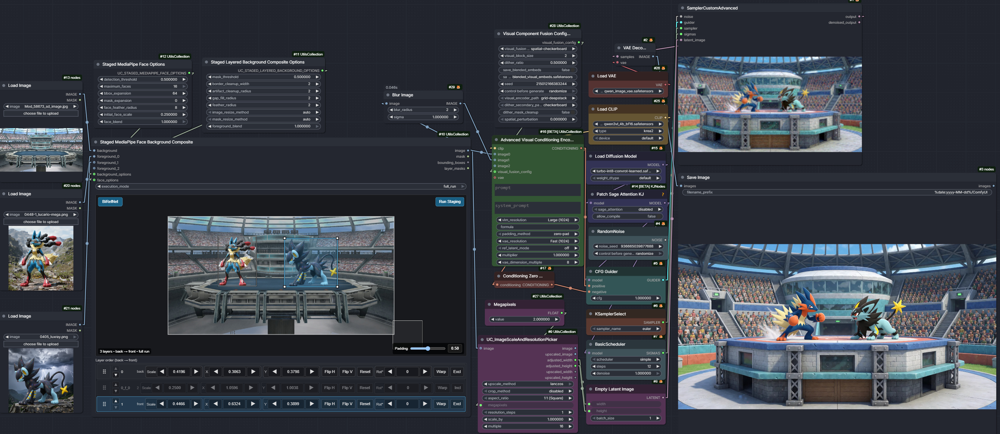

# ComfyUI-UtilsCollection

A collection of ComfyUI nodes for modern text and multimodal conditioning, image and mask processing, prompt presets, workflow parameters, loading, and general utilities. The encoder nodes track current ComfyUI Core behavior while retaining compatible legacy node IDs where practical.

## Available nodes

The list below uses the canonical node IDs. Deprecated compatibility aliases remain registered for existing workflows but are not duplicated here.

### Text encoding and conditioning

- `UC_TextEncodeSystemPrompt`
- `UC_TextEncodeFlux2SystemPrompt`
- `UC_TextEncodeKleinSystemPrompt`
- `UC_TextEncodeKrea2SystemPrompt`
- `UC_TextEncodeLtxv2SystemPrompt`
- `UC_TextEncodeZITSystemPrompt`
- `UC_TextEncodeZImageThinkPrompt`
- `UC_WeightedTextEncodeSystemPrompt`
- `UC_ScaledBiasTextEncodeSystemPrompt`
- `UC_ScaledBiasTextEncodeFlux2SystemPrompt`
- `UC_ScaledBiasTextEncodeKleinSystemPrompt`
- `UC_ScaledBiasTextEncodeLtxv2SystemPrompt`
- `UC_ScaledBiasTextEncodeZITSystemPrompt`
- `UC_ScaledBiasTextEncodeZImageThinkPrompt`
- `UC_TextEncodeSystemEditAdvanced`
- `UC_TextEncodeGemmaSystemEditAdvanced`
- `UC_AdvancedVisualConditioningEncode`
- `UC_Krea2TokenAttentionWeight`
- `UC_AttentionBiasTextEncode`
- `UC_TextConsensusBlendConfig`
- `UC_VisualFusionConfig`
- `UC_ConditioningConsensusBlend`
- `UC_VLMInputEmbeds`
- `UC_Krea2LayerProbe`
- `UC_Krea2LayerAblator`
- `UC_EncoderNodesGuide`

### Image, mask, and compositing

- `UC_Image_Color_Noise`
- `UC_ModifyMask`
- `UC_ImageBlendByMask`
- `UC_ImagePad`
- `UC_CropByMask`
- `UC_ImageCropMerge`
- `UC_ExtractMask`
- `UC_ImageAndMaskResize`
- `UC_ResizeMask`
- `UC_UnifiedBackgroundReplace`
- `UC_StagedLayeredBackgroundComposite`
- `UC_StagedLayeredBackgroundCompositeOptions`
- `UC_StagedMediaPipeFaceBackgroundComposite`
- `UC_StagedMediaPipeFaceOptions`
- `UC_LayeredBackgroundComposite`
- `UC_MediaPipeFaceCompositeOptions`
- `UC_MediaPipeFaceComposite`
- `UC_ListToImageBatch`
- `UC_ImageMatchPropertiesNode`
- `UC_OpticalFlowComposite`
- `UC_ImageInwardEdgeFill`
- `UC_ImageIterativeStretchFill`
- `UC_TextOverlayNode`

`UC_StagedLayeredBackgroundComposite` builds a scene from a background and ordered foreground sockets. Use `run_staging` to retain cutouts and populate the placement editor. Use `run_staged` to composite retained cutouts without loading models or evaluating foreground branches. Use `full_run` to restage and composite in one queue. `foreground_0` is the backmost layer. Retained cutouts are held in server memory and must be recreated after restarting ComfyUI.

`UC_StagedMediaPipeFaceBackgroundComposite` detects faces in each foreground and adds them as independently placeable layers. The background and face options nodes contain removal, extraction, feathering, and blend settings. Both staged compositor nodes output the image, combined mask, layer masks, and bounding boxes in back-to-front order.

### Staged compositor example

[Workflow JSON](workflows/CompositorExampleWorkflow.json) | [Workflow overview](workflows/CompositorExampleWorkflow.jpg) | [Source assets](workflow_assets/)

### Resolution and workflow parameters

- `UC_AdjustedResolutionParameters`
- `UC_ResolutionSelectorExtended`
- `UC_ImageScaleAndResolutionPicker`
- `UC_SwitchInverseNode`
- `UC_SoftSwitchInverseNode`
- `UC_IntegerRangeRandom`
- `UC_RandInt`
- `UC_StaticInt`
- `UC_StaticFloat`
- `UC_RandIntRange`
- `UC_ColorConvertNode`
- `UC_SeedCluster`
- `UC_FromSeedCluster`
- `UC_ExtractBoundingBox`
- `UC_AdjustBoundingBox`
- `UC_Ideogram4BoundingBoxCrop`

### Prompt presets

- `UC_SystemMessagePresets`
- `UC_SystemMessageVideoPresets`
- `UC_InstructPromptPresets`
- `UC_InstructPromptVideoPresets`
- `UC_BonusPromptPresets`
- `UC_BonusPromptVideoPresets`
- `UC_EditTargetPresets`
- `UC_EditOpPresets`
- `UC_CameraShotPresets`
- `UC_VLMSysInstrPresets`
- `UC_VLMSysQueryAddPresets`
- `UC_VLMSysInstrAdvPresets`
- `UC_LegacyPromptPresets`
- `UC_UnifiedPresets`

### Loading, text generation, and text utilities

- `UC_LoadImagePath`
- `UC_LoadImageDirectory`
- `UC_LoraLoaderCLIPOnly`
- `UC_TextGenerate`
- `UC_TextGenerateQwen35SystemPrompt`
- `UC_TagNormalizeCombine`
- `UC_BoldFrakturTextStyle`
- `UC_UnBoldFrakturTextStyle`
- `UC_WordJoiner`
- `UC_UnWordJoiner`
- `UC_JSONMinifyRepair`
- `UC_StringUnescape`

### Scheduler presets

- `Ideogram4SchedulerPreset`
